<!-- 

    

 -->

#   Yo! ꕤ˚₊⊹

    

 

<pre>
💼 STI College • BS Information Technology
💻 Aspiring Software Engineer
🇵🇭 Philippines
</pre>

🥀 Hello! I'm El, an aspiring software engineer who enjoys creating random things. Right now, I'm working on a few personal projects, writing whatever comes to mind, and playing some games. Lately, I've been playing **Reverse: 1999** and **osu!**—check them out if you have time!

###  𝕨𝕙𝕒𝕥 𝕚𝕞 𝕕𝕠𝕚𝕟𝕘

<pre>
lost out in space, hearing echoes.
</pre>

###  𝕞𝕖𝕥𝕣𝕚𝕔𝕤

<!--  -->
<!--  -->
<!--  -->
<!--  -->

###  𝕒𝕟𝕚𝕞𝕖 / 𝕞𝕦𝕤𝕚𝕔

###  𝕤𝕜𝕚𝕝𝕝𝕤

☕️ These are the languages I currently work with, but I code across many different domains—so the stack or topic doesn’t matter much to me. If something seems interesting, I’ll give it a shot.

<!-- ###  𝕥𝕣𝕠𝕡𝕙𝕚𝕖𝕤

    

 -->

 

    

  

     <kbd>
        
       &nbsp; &nbsp;  &nbsp; &nbsp; ■ ᴛᴜʀɴ ᴏɴ. ᴛᴜɴᴇ ɪɴ. ᴅʀᴏᴘ ᴏᴜᴛ. ■ &nbsp; &nbsp;  &nbsp; &nbsp;
          
     </kbd>
  

     

