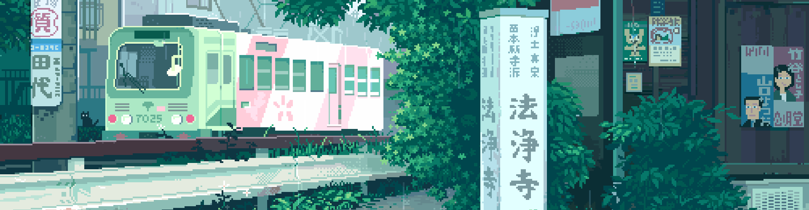
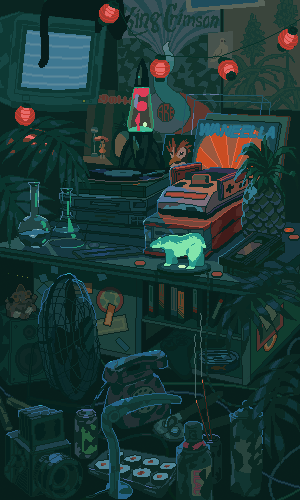
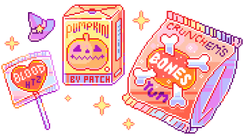

    

<h1>  Yo! ૮ ˶ᵔ ᵕ ᵔ˶ ა</h1>

<pre>
💼 Student @ STI College • BS Information Technology • 3rd Year
🌟 Coffee • Music • Games • Code • Manga
🇵🇭 Philippines
💻 Fedora (Linux) • Windows
🎮 Currently Playing: Legend of Zelda: Tears of the Kingdom
</pre>

<h3> 𝕘𝕠𝕒𝕝𝕤 / 𝕒𝕔𝕙𝕚𝕖𝕧𝕖𝕞𝕖𝕟𝕥𝕤</h3>

<pre>
🎯 Goals
[ ] - Finish capstone project
[ ] - Participate in Codefest2024
[ ] - Learn a little bit of art??
</pre>

<pre>
🏆 Achievements
🏅 - 1st Place Local Codefest 2023
🏅 - Champion Local Codefest 2024    
</pre>
  

<h3> 𝕞𝕖𝕥𝕣𝕚𝕔𝕤</h3>

<h3> 𝕒𝕟𝕚𝕞𝕖 / 𝕞𝕦𝕤𝕚𝕔</h3>

<h3> 𝕤𝕜𝕚𝕝𝕝𝕤</h3>

  

<h3> 𝕥𝕣𝕠𝕡𝕙𝕚𝕖𝕤</h3>

    

<h3></h3>
