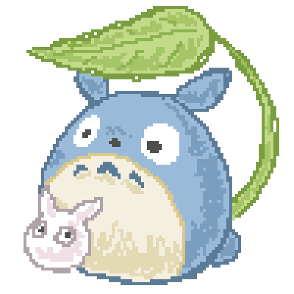

    

#   Yo! ૮ ˶ᵔ ᵕ ᵔ˶ ა

<pre>
💼 Student @ STI College • BS Information Technology • 3rd Year
🌟 Coffee • Music • Games • Code • Manga
🇵🇭 Philippines
💻 Fedora (Linux) • Windows
🎮 Currently Playing: Monster Hunter Rise
</pre>

###  𝕘𝕠𝕒𝕝𝕤 / 𝕒𝕔𝕙𝕚𝕖𝕧𝕖𝕞𝕖𝕟𝕥𝕤

<pre>
🎯 Goals
[ ] - Finish capstone project
[ / ] - Participate in Codefest2024
[ ] - Learn a little bit of art??
</pre>

<pre>
🏆 Achievements
🏅 - 1st Place Local Codefest 2023
🏅 - Champion Local Codefest 2024    
</pre>
  

   
###  𝕞𝕖𝕥𝕣𝕚𝕔𝕤

###  𝕒𝕟𝕚𝕞𝕖 / 𝕞𝕦𝕤𝕚𝕔

###  𝕤𝕜𝕚𝕝𝕝𝕤

###  𝕥𝕣𝕠𝕡𝕙𝕚𝕖𝕤

    

